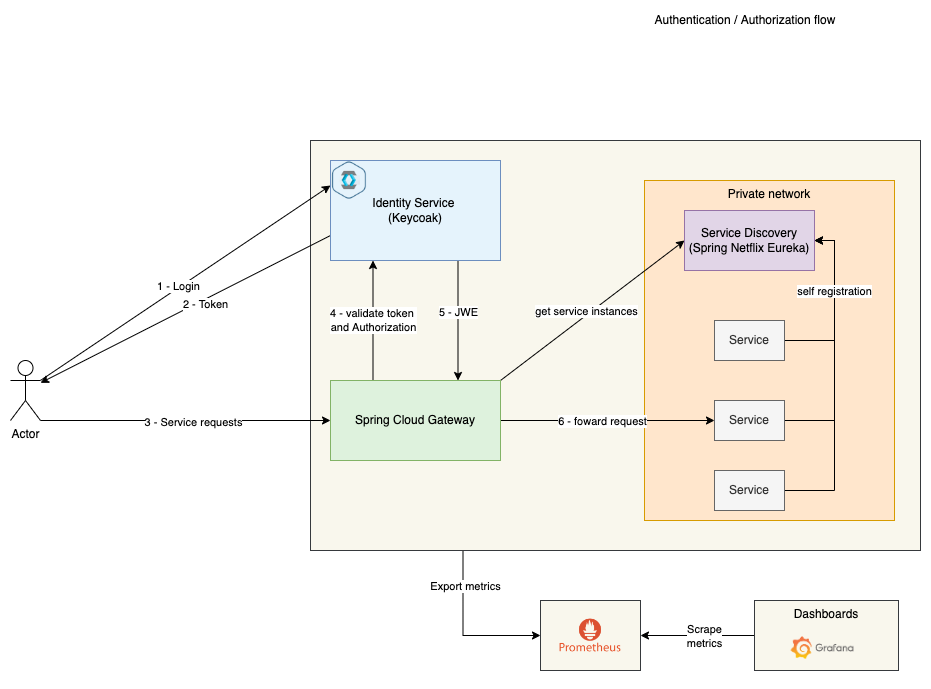

## Hi there 👋

:receipt: These repositories representes a microservices architecture based in a shopping-api.

Some techiniques and tools used:
* Microservices 
* API Gateway
* Service discovery
* Security layer - Keycloak - OpenID Connect
* Observability - Prometheus and Grafana dashboards

## General Architecture Diagram

    

